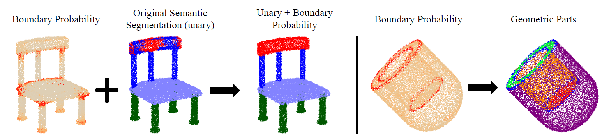
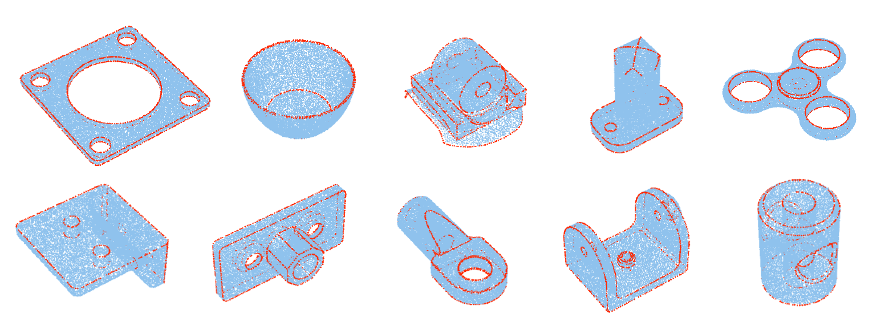

<h1 align = "center">Learning Part Boundaries from 3D Point Clouds</h1>

    Marios Loizou &emsp;
    <a href="http://geometry.cs.ucl.ac.uk/averkiou/">Melinos Averkiou</a> &emsp;
    <a href="https://people.cs.umass.edu/~kalo/">Evangelos Kalogerakis</a>  &emsp;

 

    

    <small>The output probability per point can be used in pairwise terms to improve graph-based semantic segmentation methods 
    (left) by localizing boundaries between semantic parts. It can also be used in the geometric decomposition of point clouds
    into regions enclosed by sharp boundaries detected by our method (right).</small>

<h1 align = "center">Abstract</h1> 
We present a method that detects boundaries of parts in 3D shapes represented as point clouds. Our method is based on a 
graph convolutional network architecture that outputs a probability for a point to lie in an area that separates two or 
more parts in a 3D shape. Our boundary detector is quite generic: it can be trained to localize boundaries of semantic parts 
or geometric primitives commonly used in 3D modeling. Our experiments demonstrate that our method can extract more accurate
boundaries that are closer to ground-truth ones compared to alternatives. We also demonstrate an application of our network 
to fine-grained semantic shape segmentation, where we also show improvements in terms of part labeling performance.

<h1 align = "center">Boundary Datasets</h1>

<h3>Geometric segmentation dataset</h3>

    

    <small>Marked (with red) boundaries on ABC point clouds for training.</small>

<h3>Semantic segmentation dataset</h3>

    

    <small>Marked boundaries on PartNet point clouds for training.</small>

__Datasets will be released soon__ 
